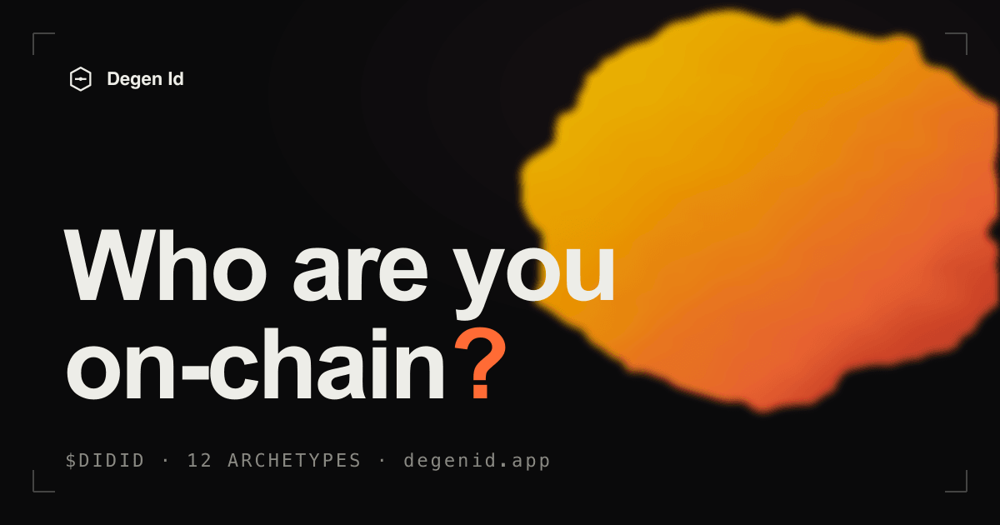

# DEGEN ID

On-chain identity for Solana. Connect a wallet, get scored across 12 archetypes,
and mint a soulbound identity card gated on holding $DIDID.

This is the DEGEN-ID organization repository. It holds the org profile
(`profile/`) and the smart contract behind the [DEGEN ID](https://degenidentity.com)
app (`contracts/`). The web app does the read-only wallet scan and scoring; the
program does the on-chain mint.

> **Draft / unaudited.** This program has not been audited or deployed to mainnet.
> Do not use with real funds before a review. The program id
> (`ADnrpikhh6f13ZcqWVenEqQzo5TrNj5Xbo4w8L5Jx4pZ`) is from a local dev keypair;
> deploy with your own keypair (`anchor keys sync`) for a real deployment.
>
> Builds and tests pass with Anchor 0.31.1 / Solana 2.3. `anchor test` mints a
> soulbound card, freezes it, and writes the archetype and score on-chain.

## Layout

```
.github/
├─ README.md
├─ assets/
│  └─ banner.png
├─ profile/
│  └─ README.md        # org profile shown on github.com/DEGEN-ID
└─ contracts/          # Anchor workspace
   ├─ Anchor.toml
   ├─ Cargo.toml
   ├─ programs/
   │  └─ degen_id/
   │     ├─ Cargo.toml
   │     └─ src/lib.rs
   └─ tests/
      └─ degen_id.ts
```

## The degen_id program

Instructions: `initialize`, `set_didid_mint`, `close_config`, `mint_identity`.
Only `anchor-lang` and `anchor-spl` are used, so the program builds self-contained
with no external NFT program.

`mint_identity(archetype, score)`:

1. **Configurable gate.** The official $DIDID mint lives in a `["config"]` PDA
   instead of being hardcoded, so the program can be deployed before the token
   exists and pointed at the mint later via `set_didid_mint` with no redeploy.
   Until it is set, minting is closed (`MintNotConfigured`).
2. **Hold-gate, checked on-chain.** Verifies the passed mint is the configured
   $DIDID mint, then that the caller holds at least `HOLD_REQUIREMENT`. The client
   value is never trusted.
3. **Mints an NFT.** Creates a fresh mint with `decimals = 0` and mints exactly 1
   to the owner.
4. **Soulbound.** Freezes the owner's token account so the card cannot be
   transferred. The freeze authority is a program PDA (`["authority"]`).
5. **Fixed supply.** Drops the mint authority, locking supply at 1.
6. **On-chain card.** Stores `archetype`, `score`, `owner`, `mint`, and
   `minted_at` in a per-wallet PDA (`["card", owner]`), which also enforces one
   card per wallet.

### Deploy / launch flow

```
1. anchor deploy                  # deploy degen_id (no token needed)
2. initialize()                   # create config, caller becomes admin
   ... later, when $DIDID launches ...
3. set_didid_mint(<$DIDID mint>)  # open the gate, no redeploy
```

### Reclaiming rent (wind-down)

Deploying a program locks SOL in rent, mostly in the program-data account. To get
it back:

```
1. close_config()                                          # refund the config PDA rent (admin)
2. solana program close <PROGRAM_ID> --recipient <wallet>  # refund the deploy rent
```

`solana program close` only works while the upgrade authority is still active. If
you want to reclaim the deploy rent later, do not run `set-upgrade-authority
--final` (which makes the program immutable). It is one or the other: reclaimable
rent or an immutable program. The per-wallet card, mint, and ATA rents belong to
the holders and are not yours to reclaim.

## Build and test

Requires [Rust](https://rustup.rs), the [Solana CLI](https://docs.solanalabs.com/cli/install),
and [Anchor](https://www.anchor-lang.com/docs/installation) (0.31.x).

```bash
cd contracts
npm install
anchor build
anchor test     # spins up a local validator and runs tests/degen_id.ts
```

Toolchain note: Solana 2.3 platform-tools ship rustc 1.84, but some recent
transitive crates require edition2024 / rustc 1.85. `Cargo.lock` pins `blake3` and
`indexmap` to pre-edition2024 releases, and `.cargo/config.toml` enables cargo's
MSRV-aware resolver (`incompatible-rust-versions = "fallback"`) so the rest
resolve to 1.84-compatible versions. Keep `Cargo.lock` committed.

## License

MIT
